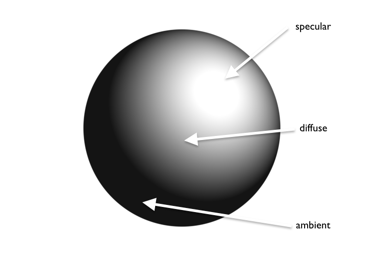
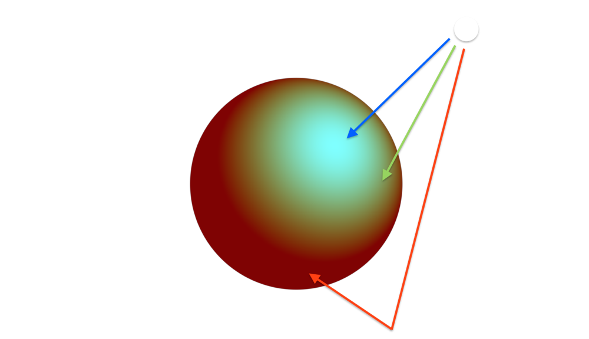
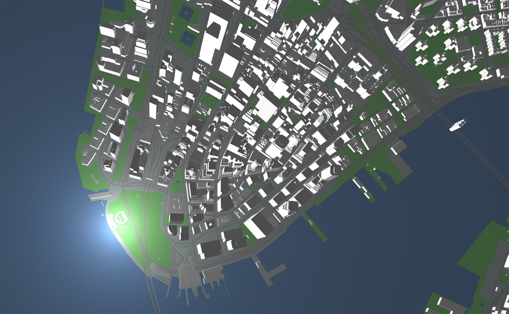
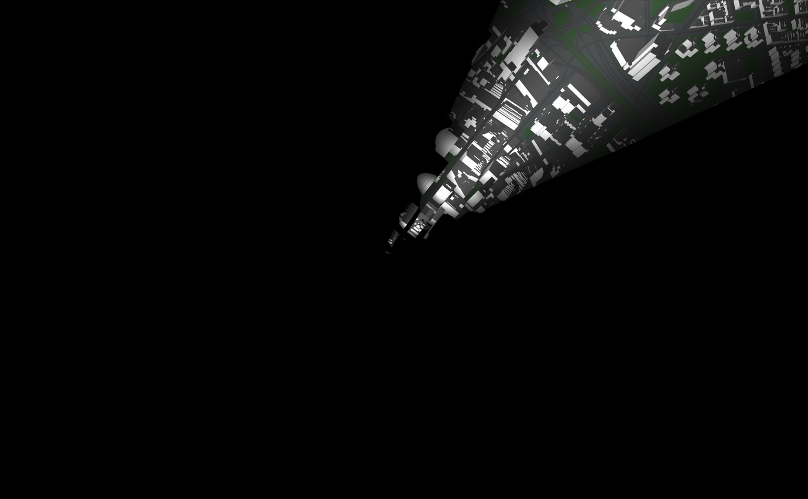

*This is the conceptual overview for Tangram's lighting system. For technical reference, see the [Lights page](lights.md).*

A Tangram map is a 3D scene, containing 3D objects constructed from your map data. The colors of those objects are taken from the [color](draw.md) declarations in your [scene file](Scene-file.md), but the way those colors appear may be modified by _lights_. (If no lights are defined, the colors will be displayed on the map with no modifications.)

Tangram uses a common computer graphics lighting system, in which **light** from light sources interacts with **materials** defined on objects. We have implemented a number of *light types* including *point lights*, *directional lights*, and *ambient lights*.

First, a bit about *light components*.

## Light components
Tangram's lighting model is based on the [Blinn-Phong shading model](https://en.wikipedia.org/wiki/Blinn%E2%80%93Phong_shading_model) used in OpenGL 2.0, which involves three *light components*: ***diffuse***, ***specular***, and ***ambient***. (These are sometimes called *terms*, as they are literally separate terms in the lighting equation.)

* *Diffuse*: this is light that comes from a light source, hits a surface, and scatters in all directions. This is what is usually understood as the visible color.

* *Specular*: these are light rays that bounce from a surface directly to our eyes, producing a distinctive bright area very common on glossy, metallic, or glass surfaces.

* *Ambient*: this is light that comes from all directions. Imagine this property as the light that bounces around in a room. Thinking of it another way, if you are outside in a sunny day, even in the shade you can perceive colors, because the sun rays reflect off of surfaces and bounce around. Ambient light is often used as a "fill" color, to brighten shadows.




##Materials

The way lights affect the appearance of an object also depends on the object's ***material***.

A material can define *diffuse*, *specular*, and *ambient* properties, which determine how much the material will reflect each kind of light.

So in order to get high specular we need a material with high specular values too; ambient light will only reflect from a material with an ambient property, and diffuse light bounces off of a diffuse material.

For more, see our [Materials Overview](Materials-Overview.md).

## Additive lighting

Physics class refresher: In the RGB additive color model, all colors can be made through some combination of red, green and blue.

Colored light illuminates objects of the same color. Red light only illuminates colors with red in them, and won't illuminate colors without any red included – the same goes for green and blue.

In this model, the color white is the combination of pure red, green, and blue – so white light can illuminate objects of any color.

(Black light only illuminates ravers, and is not included in the Blinn-Phong shading model.)

Object materials define the colors of objects, per shading component. So, a red diffuse light will illuminate a red diffuse color. And because white includes the color red, white diffuse light will illuminate a red diffuse material; likewise, a red diffuse light shining on a white diffuse surface produces the same effect. You can think of lights and materials as emitters and receptors.

In the Blinn-Phong model, the separate light components are also additive. Importantly, a single material can define all three properties, and they can all interact together.

####Example: colored light components

Let's analyze the following example of a pure white material lit with green diffuse, blue specular, and red ambient light:

```yaml
material:
    ambient: white
    diffuse: white
    specular: white

lights:
    light1:
        type: point
        position: [1,1,2.4]
        ambient: [.5,0,0]
        diffuse: [0,1,0]
        specular: [0,0,1]
```



Note that we're using a single point light which emits all three light components.

## Light types

Tangram currently defines four light types: ***directional***, ***ambient***, ***point***, and ***spotlight***. Except for the ambient light, they can all emit all three lighting components, and are often useful in combination.

### Directional Light

This light casts rays in a single direction, as though it were an infinite distance away. It can be thought of as a "sun" light, and is one of the most useful lights for 3D top-down maps. Most of Tangram's demo maps use a directional light as the primary light source.

```yaml
lights:
    light1:
        type: directional
        direction: [0, 1, -.5]
        diffuse: 1
        ambient: .3
```

[  ](http://tangrams.github.io/tangram-docs/?lights/directional.yaml)


### Ambient Light

This light casts a global ambient light into the scene. 

Because ambient lights cast light equally from every direction, they tend to flatten the appearance of 3D geometry. You can think of them as a "flat" light, and are useful for 2D maps, and for situations where color fidelity is important. 

```yaml
lights:
    light1:
        type: ambient
        ambient: 1
```

[  ](http://tangrams.github.io/tangram-docs/?lights/ambient.yaml)

### Point Light

Point lights act like a light bulb in a scene, casting rays in all directions from a central point, which is positioned in conjunction with the `origin` property.

####origin
Origin can be specified as relative to three different spaces: *world*, *camera*, and *ground*: (try each demo to see the difference):

- In *world space*, the light position is relative to a point on the map:

    ```yaml
    type: point
    position: [-74.0170, 40.7031, 100]
    origin: world
    ambient: .3
    diffuse: 1.
    specular: .2
    ```
[  ](http://tangrams.github.io/tangram-docs/?lights/pointlight-00.yaml)
    
- In *camera space*, the position is relative to the camera:

    ```yaml
    type: point
    position: [0, 0, -1800]
    origin: camera
    ambient: .3
    diffuse: 1.
    specular: .2
    ```
[  ](http://tangrams.github.io/tangram-docs/?lights/pointlight-01.yaml)

- In *ground space*, the position is relative to the point on the ground in the center of the current view:

    ```yaml
    type: point
    position: [0, 0, 100px]
    origin: ground
    ambient: .3
    diffuse: 1.
    specular: .2
    ```
[  ](http://tangrams.github.io/tangram-docs/?lights/pointlight-02.yaml)

###Other light parameters

Optionally, you can limit the effect of a point light or spotlight with the *radius* and *attenuation* parameters. By default, lights have no set radius or attenuation.

####radius

A light radius defines the limit of the light's effect. It can be specified in one of two ways:

- A single value sets an outer radius:

    ```yaml
    type: point
    position: [-74.0170, 40.7031, 100]
    radius: 500
    ambient: .3
    diffuse: 1.
    specular: .2
    ```
    [  ](http://tangrams.github.io/tangram-docs/?lights/pointlight-radius-00.yaml)

- A pair of values sets an inner and outer radius. The inner radius defines an area of constant illumunation, without any attenuation.

    ```yaml
    type: point
    position: [-74.0170, 40.7031, 100]
    radius: [500, 700]
    ambient: .3
    diffuse: 1.
    specular: .2
    ```
    [  ](http://tangrams.github.io/tangram-docs/?lights/pointlight-radius-01.yaml)

#### attenuation 

The attenuation of a light defines the way a light's intensity decreases as the outer radius is approached. The *attenuation* value is the exponent factor of the falloff function: a value of `0` = no falloff, `1` = a linear curve, `2` = a quadratic curve, etc. In general, higher values result in sharper light edges.

- If no radius is defined, the attenuation curve goes to infinity:
    ```yaml
    type: point
    position: [-74.0170, 40.7031, 100]
    attenuation: 0.1
    ambient: .3
    diffuse: 1.
    specular: .2
    ```
    [  ](http://tangrams.github.io/tangram-docs/?lights/pointlight-attenuation-00.yaml)

- With a single radius value, the attenuation curve operates between the position of the light to the outer radius.
    ```yaml
    type: point
    position: [-74.0170, 40.7031, 100]
    radius: 700
    attenuation: 2.0
    ambient: .3
    diffuse: 1.
    specular: .2
    ```
    [  ](http://tangrams.github.io/tangram-docs/?lights/pointlight-attenuation-01.yaml)

- With a pair of inner/outer radius values, the attenuation curve will operate between the inner and the outer radius.
    ```yaml
    type: point
    position: [-74.0170, 40.7031, 100]
    radius: [500,700]
    attenuation: 2.0
    ambient: .3
    diffuse: 1.
    specular: .2
    ```
    [  ](http://tangrams.github.io/tangram-docs/?lights/pointlight-attenuation-02.yaml)


### Spotlight

Spotlights describe a cone of light. They have a `direction` like a directional light, and can have `radius` and `attenuation` values like a point light, but they also have two unique properties: 

* ```angle``` defines the width of the spotlight's beam, in degrees. By default this is ```angle: 20```
* ```exponent``` is like `attenuation`, but from the center of the beam to the sides. By default this is ```exponent: .2```

```yaml
lights:
    light1:
        type: spotlight
        position: [-74.0170, 40.7031, 100]
        direction: [1, 1, 0]
        exponent: 30.
        ambient: .3
        diffuse: 1
        specular: .2
```
[  ](http://tangrams.github.io/tangram-docs/?lights/spotlight.yaml)
