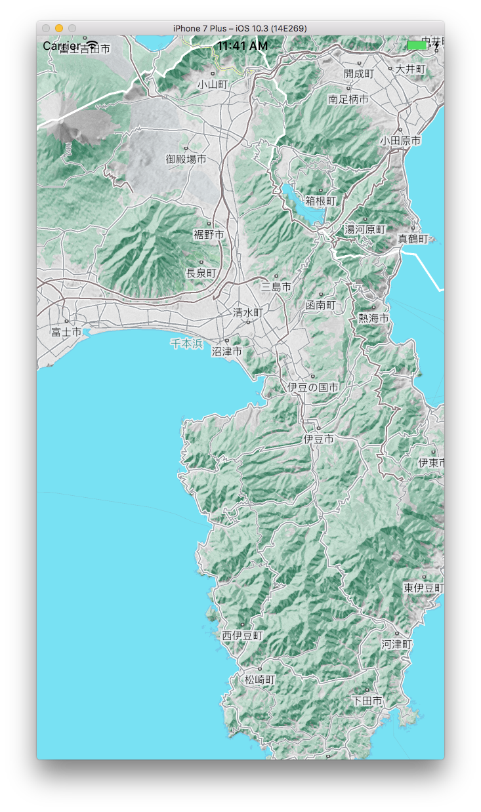
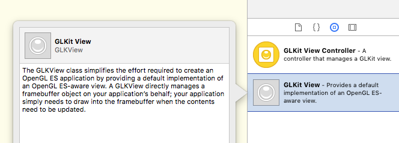
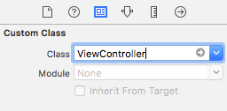

# Walkthrough: Add a Tangram map to an iOS application

With the Tangram iOS framework, you can easily get started and create nice 2D and 3D maps in your iOS application. The customizable stylesheet enables you to have the finest control over the rendering of your map, tweaking how the lighting, geometry, labels would look. The Tangram iOS framework is an [open source](https://github.com/tangrams/tangram-es) project, and welcomes feedback. If you have any issue using the iOS framework, you can directly open an issue on github and we will do our best to help you from there.

This walkthrough will be using Swift for code samples, but The Tangram iOS Framework can be used from both Objective-C and Swift.

You can follow this guide to add a Tangram map to your iOS application. If you are looking to use Tangram with other cartographic tools like search, geocoding or routing, you should check the [Mapzen iOS SDK](https://mapzen.com/documentation/ios/).

>This guide will assume some knowledge of iOS software development.
>If you want more information about writing iOS applications, visit the [Apple resources for iOS](https://developer.apple.com/ios/resources/).

We recommend you to use Cocoapods in order to use the Tangram iOS framework. If you don't have it installed yet, check out how to install it over at [https://cocoapods.org/](https://cocoapods.org/).

### Run the simple map demo application

In order to run a simple demo app, and once CocoaPods has been installed, you can run the demo application by running the following:

```sh
pod try Tangram-es
```

This will open up XCode, you can then build and run the sample project.



### Adding Tangram to an iOS application in 5 steps

1. **Add the tangram binary Framework to your XCode project**.

Using the recommended way of using the framework with CocoaPods, adding the Tangram Pod to your app is as simple as adding the following to your `Podfile`:

```sh
pod 'Tangram-es', '~> 0.6.0'
```

Then run from your shell:

```sh
pod install
```

You can know more about setting up a Pod file from [the CocoaPods documentation](https://guides.cocoapods.org/using/the-podfile.html).

If you are not using CocoaPods, you can download the latest version of the framework from [our releases](https://github.com/tangrams/tangram-es/releases), then simply drag and drop the Framework into your iOS project. Then, from your poject settings under `Embedded Binaries`, click on `+` to add `TangramMap.framework`, and make sure that the framework appears in the build phases with _Code Sign On Copy_ checked.


>If you are using CocoaPods, make sure to open your `xcworkspace` project (not `xcodeproj`).

2. **Create a basic `ViewController` that inherits from `TGMapViewController`**.

```swift
import UIKit
import TangramMap

class ViewController: TGMapViewController {

    override func viewDidLoad() {
        super.viewDidLoad()
    }

    override func didReceiveMemoryWarning() {
        super.didReceiveMemoryWarning()
    }
}
```

`TGMapViewController` description can be found on the [iOS framework documentation](https://mapzen.com/documentation/tangram/ios-framework/0.6.0/).

3. **Add a GLKit View to your storyboard**. Make sure to select the storyboard you want the map to be rendered on, then add the `GLKit View` that Tangram will use to perform rendering.



Once added to your storyboard, make sure that the custom class of your GLKit View is referencing the custom class that we just created.



4. **Add scene file to your application assets**. The scene file is a YAML document that specifies the appearance of your map. You can write your own scene file or use one of the Mapzen styles like   [Bubble Wrap](https://github.com/tangrams/bubble-wrap), [Walkabout](https://github.com/tangrams/walkabout-style), [Cinnabar](https://github.com/tangrams/cinnabar-style), or [Refill](https://github.com/tangrams/refill-style). Once you've chosen a Mapzen scene or made your own, drag and drop the scene and all of its resources to your XCode project, and make sure that all the resources appear in the _Copy Bundle Resources_ step of your iOS application _Build Phases_:


>Mapzen’s vector tile service provides GeoJSON, TopoJSON, and MVT tiles that you can use with Tangram. Mapzen scene files use this service as their data source. If you want to use Mapzen vector tiles, you will need to sign up for a free API key at [mapzen.com/developers](https://mapzen.com/developers).

5. **Initialize and load your scene at runtime**. With `ViewController` declared to load in your storyboard, you are now ready to load the scene:

```swift
class ViewController: TGMapViewController {

    override func viewWillAppear(_ animated: Bool) {
        let sceneURL = "walkabout-style-more-labels.yaml"
        super.loadSceneFileAsync(sceneURL, sceneUpdates: [ TGSceneUpdate(path: "global.sdk_mapzen_api_key", value: <YOUR_API_KEY_HERE>) ])
    }

    [...]
}
```

### Next steps
In this guide, you learned how to add a Tangram map to your iOS application. Now you can:

- Learn how to write or edit a Tangram [scene file](https://mapzen.com/documentation/tangram/Scene-file/),
- See [more examples](https://github.com/tangrams/tangram-android-demos) of things your application can do with the map, or
- Look at the [reference documentation](https://mapzen.com/documentation/tangram/ios-framework/0.6.0/) for the Tangram iOS framework.
